# 💻 C++ Portfolio

## A Collection of C++ Projects

A portfolio of practical C++ projects demonstrating **Object-Oriented Programming, file handling, data persistence, authentication, transaction processing, and console application development**.

This repository contains **four C++ projects**, including a comprehensive **Currency Exchange & Bank Management System**, an **ATM Simulator**, and two **console-based games**.

## 🛠️ Technologies and Skills

   

- C++
- Object-Oriented Programming
- Classes and objects
- Encapsulation
- Inheritance
- Structures
- Enumerations
- Vectors
- File I/O
- Data persistence
- Authentication
- Authorization
- Permissions and access control
- Input validation
- Error handling
- Transaction processing
- Currency conversion
- Random number generation
- Console application development
- Modular programming

## 📁 Repository Structure

```text
CPP-Projects/
│
├── 01-CurrencyExchange-Bank-Management-cpp/
│   ├── *.cpp
│   ├──*.h
│   ├── *.slnx
│   ├── Currencies.txt
│   ├── LoginRegister.txt
│   ├── TransfersLog.txt
│   └── Users.txt
│
├── 02-ATM-Simulator-cpp/
│   ├── ATMSimulator.slnx
│   └── Clients.txt
│
├── 03-Rock-Paper-Scissors-cpp/
│   └── RockPaperScissors.slnx
│
├── 04-Math-Quiz-Game-cpp/
│   └── MathQuizGame.slnx
│
├── screenshots/
│   └── *.png
│
├── README.md
└── LICENSE
```

## 🚀 Projects

## 01 – Currency Exchange & Bank Management

A comprehensive C++ banking management system combining client management, banking transactions, currency exchange, user authentication, permissions, and persistent data storage.

The application uses a modular architecture with multiple C++ source and header files to separate responsibilities and organize the system.

### 🔐 Login Credentials

Use the following credentials to log in:

- Username: admin
- PIN/Password: 1234

Note: These credentials are provided for demonstration purposes for this portfolio project.

### 👥 Client Management

- List clients
- Add new clients
- Delete clients
- Update client information
- Find clients
- Validate account numbers
- Store client information persistently

### 💰Banking Transactions

- Deposit money
- Withdraw money
- Transfer money between accounts
- Validate account balances
- Confirm transactions
- Update account balances
- Record transfer history

### 💱 Currency Exchange

- View supported currencies
- Search for currencies
- Convert between currencies
- Use exchange rates
- Perform currency calculations

### 👤 User Management

- List users
- Add users
- Delete users
- Update users
- Find users
- Manage user permissions
- Control access to system functions

### 📋 Logging

The application maintains records related to system activity and transactions.

- Login register/history
- Transfer history
- Date and time records
- Source account information
- Destination account information
- Transaction amounts
- Account balances
- User responsible for operations

### 📂 Data Files

The project uses text files for persistent data:

- `Currencies.txt`
- `LoginRegister.txt`
- `TransfersLog.txt`
- `Users.txt`

### 🧠 Technical Concepts: Currency Exchange and Bank Management

- C++
- Object-Oriented Programming (OOP)
- Classes and objects
- Encapsulation
- Inheritance
- Static members and methods
- Structures
- Enumerations
- Vectors
- File I/O
- Data persistence
- User authentication
- Authorization
- Permissions
- Bitwise operations
- Input validation
- Error handling
- Transaction processing
- Currency conversion
- Modular application design
- Menu-driven console applications

### 📸 Screenshots

#### Currency Exchange and Bank Management

  
  

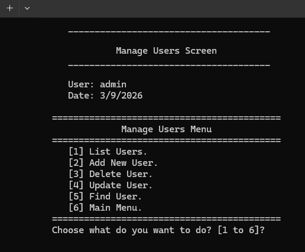
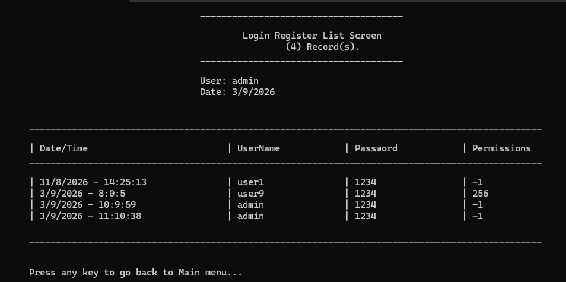
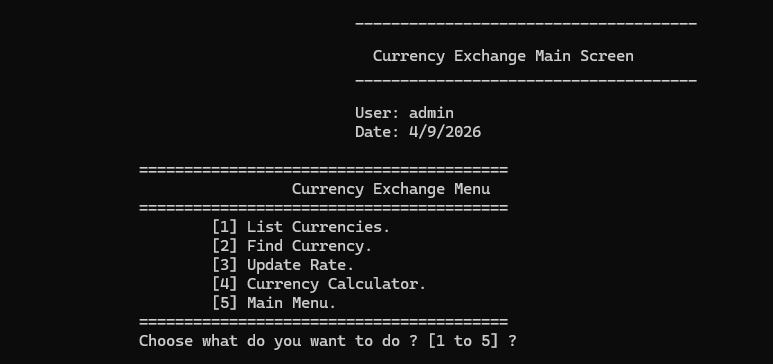

## 02 – ATM Simulator

A console-based ATM simulation system that provides common ATM operations through an interactive menu-driven interface.

The application uses client information stored in Clients.txt and simulates common ATM operations.

### 🔐 ATM Login Credentials

Use the following credentials to log in:

- **Account Number:** `a1`
- **PIN / Password:** `1234`

Note: These credentials are provided for demonstration purposes for this portfolio project.

### 💳 ATM Operations

- Account number authentication
- PIN authentication
- Quick withdrawal
- Normal withdrawal
- Deposit
- Balance checking
- Logout functionality
- Persistent client data
- Input validation
- Balance verification
- Transaction processing
- Menu-driven interface

### 📂 Project Files: ATM-Simulator

```text
02-ATM-Simulator-cpp/
├── ATMSimulator.slnx
└── Clients.txt
```

### 🧠 Technical Concepts: ATM-Simulator

- C++
- File I/O
- Data persistence
- Input validation
- Balance validation
- Transaction processing
- Functions
- Structures
- Vectors
- Conditional statements
- Loops
- Menu-driven applications
- Console user interfaces

### 📸 Screenshots: ATM Simulator

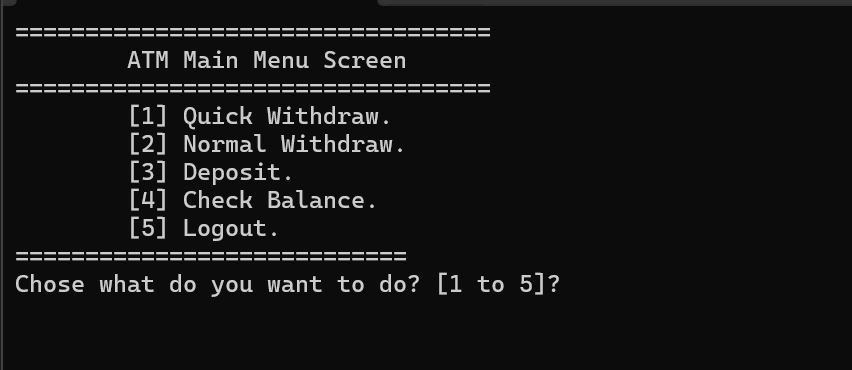

## 03 – Rock Paper Scissors

A classic console-based Rock-Paper-Scissors game where the player competes against the computer.

The computer generates a random choice, and the application determines the winner based on the selected moves.

### 🎮 Features

- Player versus computer gameplay
- Random computer choices
- Player input
- Input validation
- Win, lose, and draw detection
- Score tracking
- Game result display
- Play-again functionality

### 🧠 Technical Concepts: Rock Paper Scissors

- C++
- Functions
- Enumerations
- Conditional statements
- Loops
- Random number generation
- Input validation
- Game logic
- Console output

### 📂 Project Files: Rock-Paper-Scissors

```text
03-Rock-Paper-Scissors-cpp/
└── RockPaperScissors.cpp
```

### 📸 Screenshots: Rock-Paper-Scissors

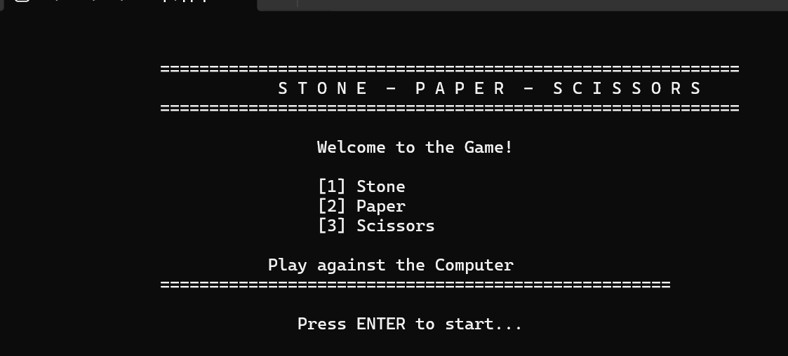
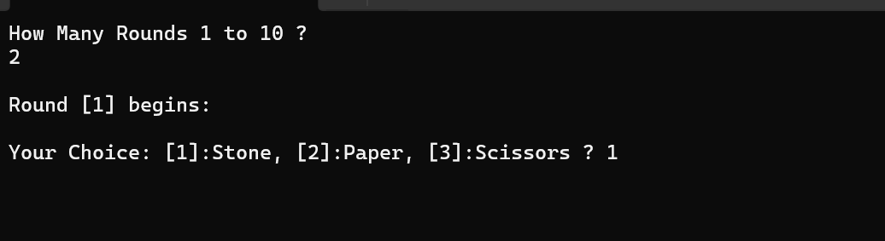
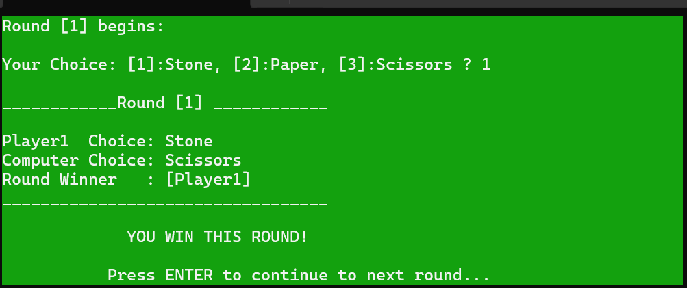
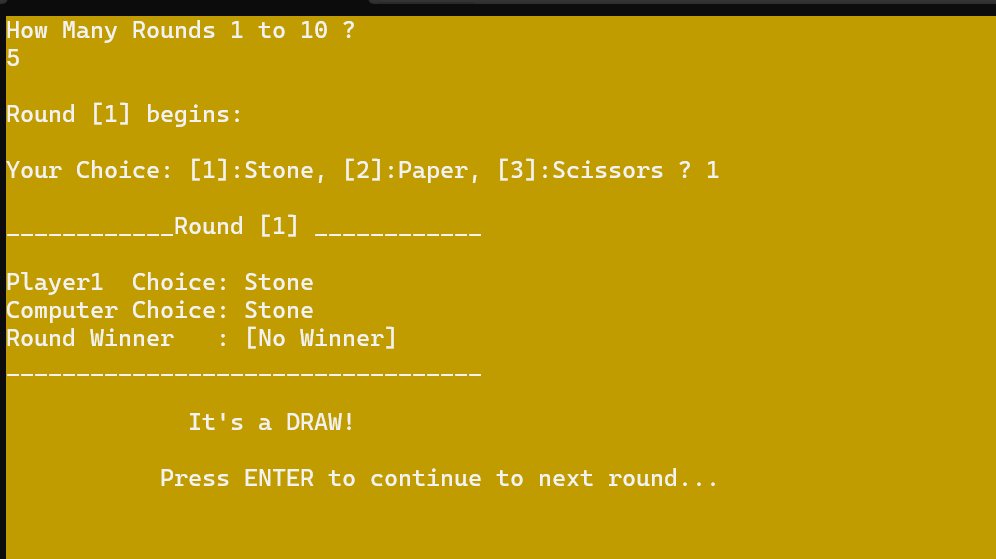
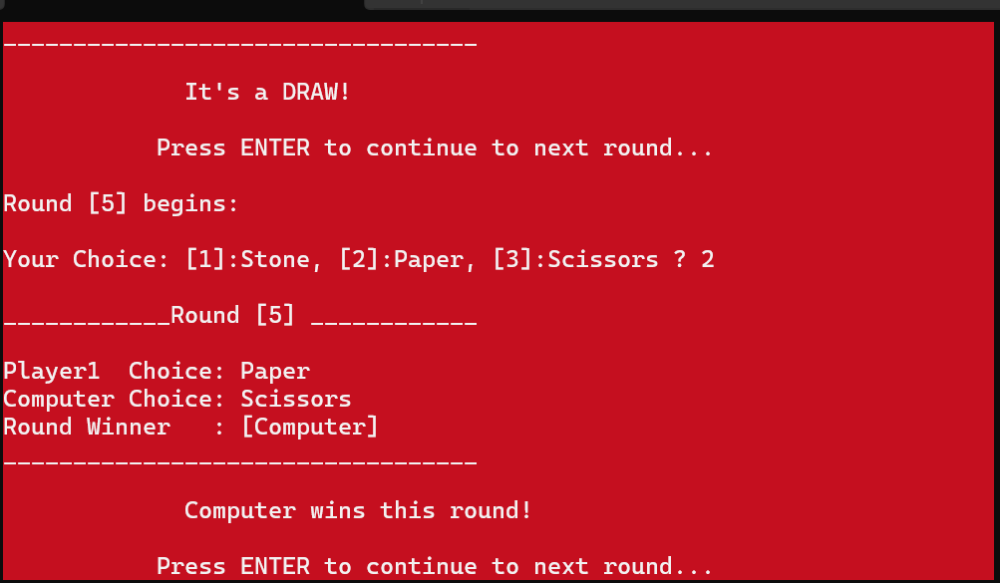
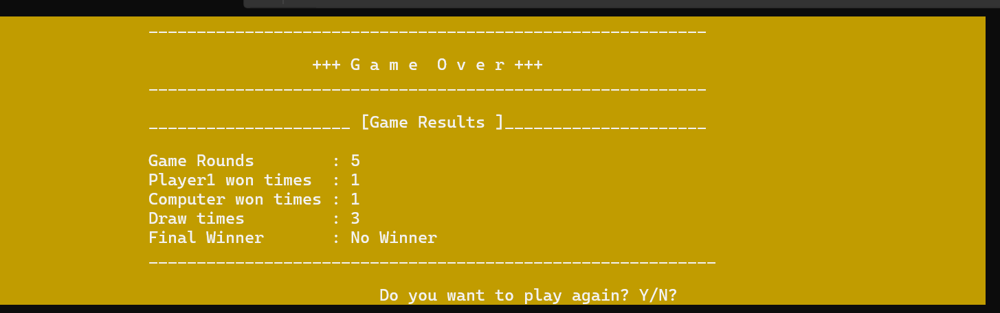

## 04 – Math Quiz Game

An interactive console-based mathematics quiz game with multiple difficulty levels and mathematical operations.

Players can select the number of questions and choose between different difficulty levels and operations.

### 🎯 Features: Math Quiz Game

- Select the number of questions
- Easy difficulty
- Medium difficulty
- Hard difficulty
- Mixed difficulty
- Addition
- Subtraction
- Multiplication
- Division
- Mixed operations
- Randomly generated questions
- Automatic score calculation
- Correct and incorrect answer detection
- Pass or fail result
- Replay functionality
- Visual feedback

### 🧠 Technical Concepts: Math Quiz Game

- C++
- Functions
- Enumerations
- Loops
- Conditional statements
- Random number generation
- Arithmetic operations
- Input validation
- Score calculation
- Game logic
- Console applications

### 📂 Project Files: Math Quiz Game

```text
04-Math-Quiz-Game-cpp/
└── MathQuizGame.cpp
```

### 📸 Screenshots: Math Quiz Game

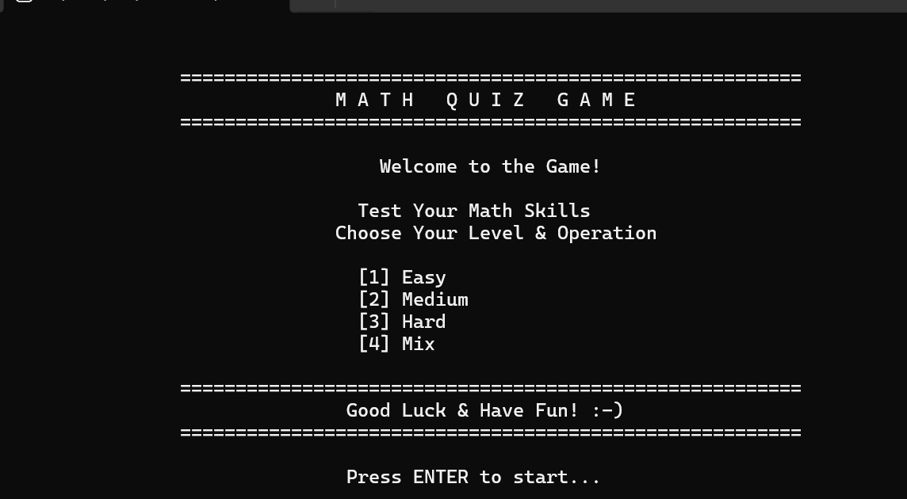
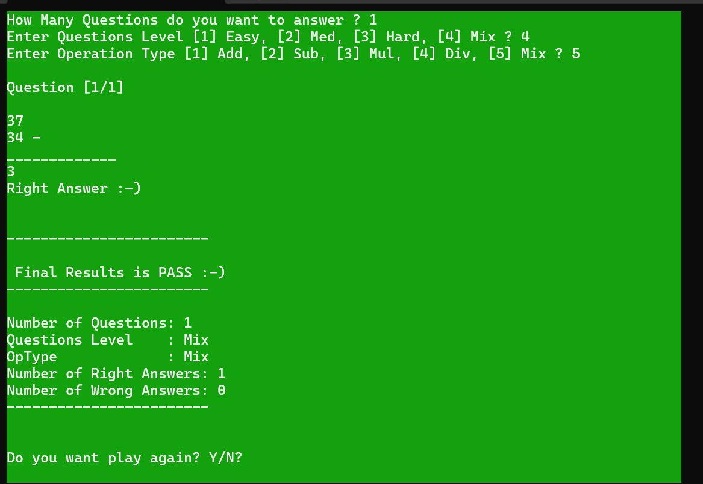
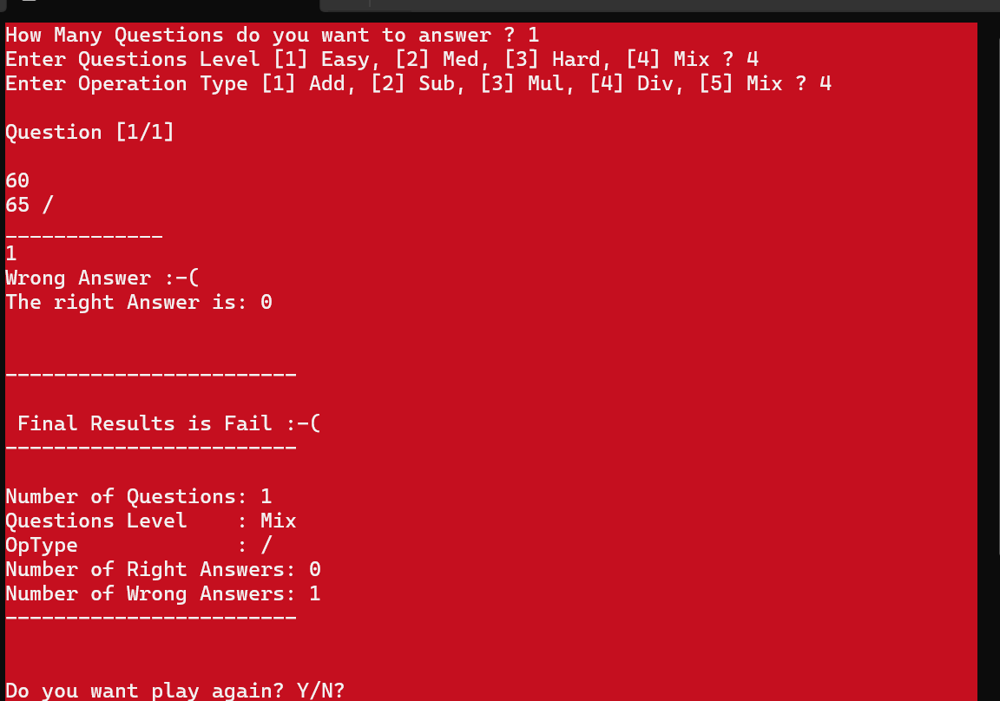

## 🛠️ How to Run

### Visual Studio 2022

The projects can be compiled and run using Visual Studio 2022 with the required C++ development tools installed.

#### Steps

1. Clone or download this repository.
2. Open the desired `.slnx` project in Visual Studio 2022.
3. Make sure the **Desktop development with C++** workload is installed.
4. Select the desired project.
5. Build the project.
6. Run the application.
7. For projects requiring authentication, use the demo credentials provided in the corresponding project section.

### Using g++

Individual `.cpp` files can also be compiled using `g++`.

#### Rock Paper Scissors

```bash
g++ RockPaperScissors.cpp -o RockPaperScissors
./RockPaperScissors
```

#### Math Quiz Game

```bash
g++ MathQuizGame.cpp -o MathQuizGame
./MathQuizGame
```

#### ATM Simulator

```bash
g++ ATMSimulator.cpp -o ATMSimulator
./ATMSimulator
```

For the **Currency Exchange & Bank Management** project, compile the required `.cpp` source files together.

## 📚 Skills Demonstrated

These projects demonstrate practical experience with:

- C++
- Object-Oriented Programming (OOP)
- Classes and objects
- Encapsulation
- Inheritance
- Structures
- Functions
- Vectors
- Enumerations
- File I/O
- Data persistence
- User authentication
- Authorization
- Permissions and access control
- Banking transactions
- Currency conversion
- Input validation
- Error handling
- Random number generation
- Game development
- Menu-driven applications
- Console application design
- Modular programming

## 📸 Project Screenshots

Screenshots demonstrate the functionality and user interfaces of the projects, including:

- Authentication and login
- Main menus
- Banking operations
- Currency exchange
- ATM operations
- Rock Paper Scissors gameplay
- Math quiz questions
- Results and application output

## 📜 License

This project is released under the MIT License.

See the `LICENSE` file for more details.

⭐ If you find this portfolio useful, feel free to star the repository.
